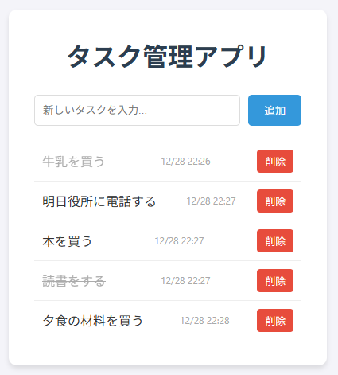
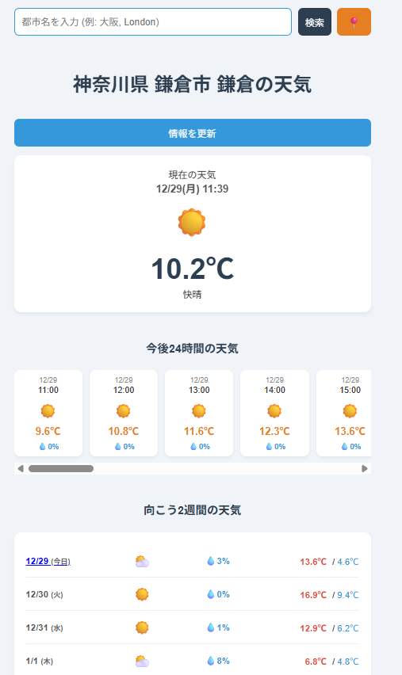

# Learning Web Apps Portfolio

Webアプリケーション開発の学習記録用リポジトリです。
作成したアプリは GitHub Pages で公開しており、以下のリンクから実際に動作を確認できます。

## 🚀 デモサイト (Live Demo)
**[👉 ポートフォリオサイトへ移動し、アプリを起動する](https://furuchai.github.io/learning-web-apps/)**

---

## 📂 プロジェクト一覧

### 1. To-Do App (タスク管理アプリ)
ローカルストレージを使用した、データの永続化に対応したタスク管理ツールです。

* **使用技術:** HTML5, CSS3, JavaScript (Vanilla), LocalStorage
* **主な機能:**
    * タスクの作成(Create)、読み込み(Read)、削除(Delete)
    * タスクの完了状態トグル（取り消し線）
    * データのローカル保存（ブラウザを閉じても保持）

---

### 2. Global Weather App (多機能天気予報アプリ)
Open-Meteo APIを使用した、世界中の天気を検索できる高機能な天気予報アプリです。

* **使用技術:** HTML5, CSS3, JavaScript (ES6+), Fetch API
* **API:** Open-Meteo (Weather Forecast API / Geocoding API)
* **主な機能:**
    * **GPS連携:** `Geolocation API` を使用し、現在地の天気をワンタップで取得
    * **都市検索:** ジオコーディングにより、地名（日本語・英語）から座標を特定
    * **詳細データ表示:**
        * 現在の気温・天気・日時
        * 24時間ごとの気温・降水確率（横スクロール表示）
        * 向こう2週間の天気・気温・降水確率（リスト表示）

---

## 🛠️ 開発環境
* **PC:** MSI Prestige 15
* **OS:** Windows 11
* **Editor:** VS Code
* **Terminal:** Git Bash / PowerShell